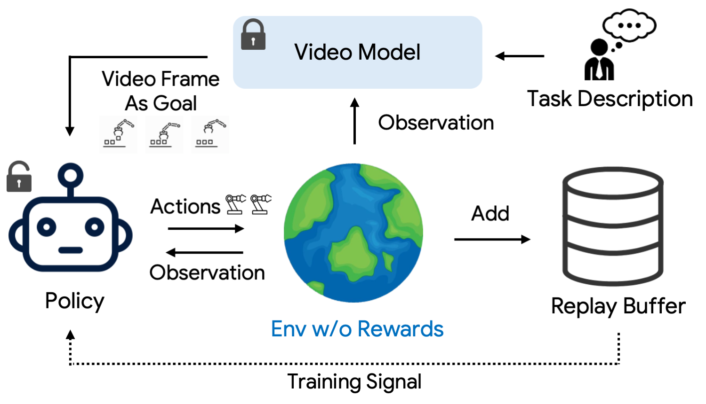

# Grounding Video Models to Actions through Goal Conditioned Exploration

[[Project page]](https://video-to-action.github.io/)
[[Paper]]()
[[ArXiv]]()
<!-- [![][colab]][maze2d-eval-demo] -->
<!-- [[Data]]() -->
<!-- [Colab]() -->
<!-- declare varibles -->
<!-- [colab]: <https://colab.research.google.com/assets/colab-badge.svg> -->
<!-- [maze2d-eval-demo]: <https://colab.research.google.com/drive/1pARD89PfSzF3Ml6virZjztEJKWhXVkBY?usp=sharing> -->


[Yunhao Luo](https://devinluo27.github.io/)<sup>1,2</sup>,
[Yilun Du](https://yilundu.github.io/)<sup>3</sup>

<sup>1</sup>Georgia Tech,
<sup>2</sup>Brown,
<sup>3</sup>Harvard


This is the official implementation for "*Grounding Video Models to Actions through Goal Conditioned Exploration*".


<p align="center">
  
</p>

<!-- <p align="center">
  
</p> -->

**Grounding Video Model to Action.** 
Our approach learns to ground a large pretrained video model into continuous actions through goal-directed exploration in the environment. Given a synthesized video, a goal-conditioned policy attempts to reach each visual goal in the video, with data in the resulting real-world execution saved in a replay buffer to train the goal-conditioned policy.


<!-- ## 🛝 Try it out!
We provide a Google Colab notebook [![][colab]][maze2d-eval-demo] for the Maze2D enviornments.  In this notebook, you can enter your own obstacle locations and set the agent's start/goal positions, and use the pre-trained model to generate motion plans. Additional jupyter notebook demos can be found in the `examples` directory. -->
<!-- Check out our Google Colab notebooks for motion plan generation here. -->


## 🛠️ Installation
The following procedure should work well for a GPU machine with cuda 11.8. Our machine is installed with Red Hat Enterprise Linux v9.2 and loads the following modules:
```
1) zlib; 2) cuda/11.8.0; 3) git-lfs; 4) expat; 5) mesa/22.1.6; 6) libiconv; 7) ffmpeg; 8) glew;
```
For some other Linux versions, the equivalent modules might be required. 

Please follow the steps below to create a conda environment to reproduce our simulation benchmark results on Libero environment.

1. Create a python env.
```console
conda create -n v2a_libero_release python=3.9.19
```
Please keep the conda env name as above, since it will be an identifier to register env.

2. Install other packages in `requirements.txt` (this might take several minutes).
```console
pip install -r requirements.txt
```


<!-- 📦 🗃️ 📥 🗂️-->
## 🗃️ Prepare Data

1. Download the pre-trained video model.

<!-- <p align="center">
  
</p> -->

Please visit this OneDrive [folder](https://1drv.ms/f/c/b25b9b5879968c8a/EmU2jKN0WIhDqGroD0yLdnwBJvMlcHmA5dydO4rVz_x6RA?e=LRf0oK) for video model checkpoints. 
For the Libero environment, download `libero-video-model.zip`, put it in the home directory of this repo, and unzip it with the following command
```console
unzip libero-video-model.zip -d .
```
This command should unzip the checkpoint to a directory `ckpts`. 
The training of our video model follows [AVDC](https://github.com/flow-diffusion/AVDC).


2. Download random action data.
For efficiency and reproducibility, we pre-sampled a dataset of random actions for policy training and is hosted in this OneDrive [folder](https://1drv.ms/f/c/b25b9b5879968c8a/EmU2jKN0WIhDqGroD0yLdnwBJvMlcHmA5dydO4rVz_x6RA?e=LRf0oK).
For Libero environment, download `lb_randsam_8tk_perTk500.hdf5` and move it to default location relative to the root of this repo:
```console
export lb_dir= data_dir/scratch/libero/env_rand_samples
mkdir -p $lb_dir && mv lb_randsam_8tk_perTk500.hdf5 $lb_dir
```

This data file is bulky, where `rclone` can be used if downloading to a remote machine. We also provide the code to collect your own random action in `environment/libero/lb_data`.

<!-- ```console
``` -->


## 🕹️ Train a Model
<!-- downloaded -->
With the video model checkpoint and random action dataset prepared, you can now start training the model with video-guided exploration.

To launch the training for Libero, run
```console
sh scripts/train_libero_dp.sh
```
You can change the `$config` variable inside the script above to launch different experiments. You can refer to the default config in the script as template.


## 📊 Using Pretrained Models


### Downloading weights
We provide links to pre-trained goal-conditioned policy models below, along with their corresponding config files in this repo. All models are hosted under this OneDrive [folder](https://1drv.ms/f/c/b25b9b5879968c8a/EmU2jKN0WIhDqGroD0yLdnwBJvMlcHmA5dydO4rVz_x6RA?e=LRf0oK).

<!-- TODO: -->
| Model | Link | Config
| :---: | :---: | :---: |
| Libero 8 Tasks | [Link](https://1drv.ms/u/c/b25b9b5879968c8a/ERQUOwVJAV5BrUTii2pRj1MB-h27gxJ4Q8X4AXEk96GcQg?e=fTmSZm) | `config/libero/lb_tk8_65to72.py`


You need to put the downloaded zip files in the root directory of this repo and unzip them, so that the created files can be in proper relative locations.
The files will be automatically put under the `logs` folder, which is organized roughly according to the following structure (some additional prefix and postfix might be added):
```
└── logs
    ├── ${environment_1}
    │   ├── diffusion
    │   │   └── ${experiment_name}
    │   │       ├── model-${iter}.pt
    │   │       └── {dataset, trainer}_config.pkl
    │   └── plans
    │       └── ${experiment_name}
    │           ├── 0
    │               ├── {experiment_time:%y%m%d-%H%M%S}
    │               ├── ...
    │
    ├── ${environment_2}
    │   └── ...
```

The `model-${iter}.pt` files contain the network weights and the `{}_config.pkl` files contain the instantation arguments for the relevant classes. A dummy random action dataset will also be created as a placeholder for loading.

<!-- 
For example,
```console
[potential-motion-plan-release]$ unzip .zip -d .
``` -->

 <!-- and placed them in appropriate directory,  -->
### Policy Rollout
After downloading and unzipping the model weights, you can launch policy rollout using the script provided below. The results will be saved in `.mp4` and `.json` files.
To evaluate different models, you can change the `$config` varibale inside the script, which should be the relative path to a config file.

For Libero environment, run:
```console
./diffuser/libero/plan_lb_list.sh $1 $2
```

Please replace `$1` by  how many episodes to evaluate on (e.g., 25) and `$2` by a GPU index.


<!-- ### Jupyter Notebook Examples
To help you better understand and use the codebase, we provide multiple jupyter notebooks under `examples` folder, where you can generate motion plans and visualize them interactively. Feel free to try them out. If missing files are reported, please download the corresponding files from the OneDrive link above.  -->


<!-- ======================= -->

<!-- ## 🔩 Key Components -->

## ➕ Add an Experiment
We create a new config file under the `config` folder for a new experiment. Each experiment will create a new folder under `logs`. You can refer to existing config files as examples.


## 🏷️ License
This repository is released under the MIT license. See [LICENSE](LICENSE) for additional details.


## 🙏 Acknowledgement
* The implementation of Diffusion Policy is adapted from [diffusion_policy](https://github.com/real-stanford/diffusion_policy).
* The implementation of our video generative models is based on [AVDC](https://github.com/flow-diffusion/AVDC).

Contact [Yunhao Luo](https://devinluo27.github.io/) if you have any questions or suggestions.


## 📝 Citations
If you find our work useful, please consider citing:
<!-- TODO: -->
```
```
